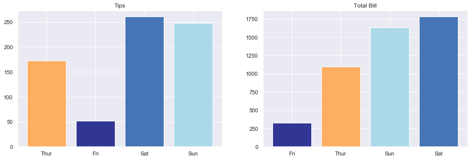
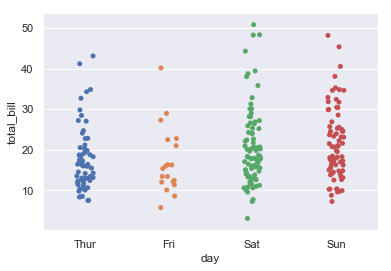
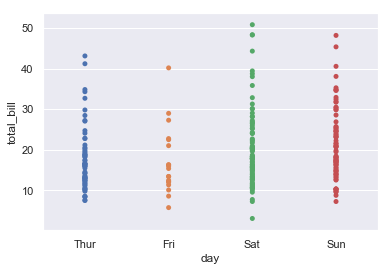
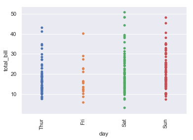

# Python Snippets

## Default imports

The following code shows the default libraries I import at the beginning of nearly every notebook.


```python
from fastai.imports import *
from fastai.structured import *
from matplotlib.pyplot import figure
sns.set()

%load_ext autoreload
%autoreload 2

%matplotlib inline
```

The `from fastai...` commands handle most of the libraries I want to import. These short commands might make the process somewhat opaque, having to look up the imports in the fastai .py files themselves if one wants to know what exactly was imported, but saves long lines of `import xyz`  at the beginning of every notebook. The detailed imports fastai makes can be looked up [here](https://github.com/fastai/fastai/tree/master/fastai).

## Jupyter specifics

### Magic commands
So called "magic commands" are functions specific to Jupyter which are called by putting "%" in front of the command.  
`%timeit` measures the execution duration of a function. `%prun` runs a function through the python profiler which analyses the runtime of each part of the function and subfunctions called.
```python
%timeit func()
%prun func()
```
If you run a cell and get an exception, `%debug` is your friend. The `%debug` magic opens an interactive debugger that brings you to where the exception occurred and allows you to step in and out of the functions called.
https://twitter.com/radekosmulski/status/945739571735748609

### Bash
Access bash commands by using `!` beforehands and use curly brackets to access Python variables in Jupyter. Following command prints the content of a specific folder in Jupyter.
```python
PATH = "path/to/folder/"
!ls {PATH}
```
Get a sense of the dataset before importing it (especially handy and fast when handling very big datasets).
```python
!head path/to/file.csv
```
Show the contents of a folder and its sizes. `-l` shows file or directory size, modified date and time, file or folder name and owner of file and its permission. The `h` option prints the output in 'Human Readable Format'.
```python
!ls -lh
```
`wc` is a bash command that counts words, lines, and bytes or character. Following command counts mumber of newlines.
```
wc -l
```

___

## Python

## Dictionary

**sorting based on specific element**


```python
l = dict([['a', 1], ['b', 2]])
```


```python
l
```


    {'a': 1, 'b': 2}


```python
sorted(l, key=lambda x: l[x], reverse=True)
```


    ['b', 'a']


## Default and flexible arguments

These 2 arguments are used when function can expect variable number of arguments: `*args` and `**kwargs`.  
Whatever is passed in `*args` is taken as tuple.  
Whatver is passed in `**kwargs` is considered as dictionary.  


```python
# flexible arguments *args
def f(*args):
    print(type(args))
    print(args[0])
    for i in args:
        print(i)


f(1)
f(1, 2, 3, 4)
f([1, 2, 3])
```

    <class 'tuple'>
    1
    1
    <class 'tuple'>
    1
    1
    2
    3
    4
    <class 'tuple'>
    [1, 2, 3]
    [1, 2, 3]


```python
def f(**kwargs):
    print(type(kwargs))
    """ print key and value of dictionary"""
    for key, value in kwargs.items():
        print(key, " ", value)


f(country='spain', capital='madrid', population=123456)
```

    <class 'dict'>
    country   spain
    capital   madrid
    population   123456


## Regular expressions


```python
import re
```


```python
tweet = '''Good advice! RT @TheNextWeb: What I would do differently if I was learning to code today http://t.co/lbwej0pxOd cc: @garybernhardt #rstats'''
```


```python
desired_output = 'Good advice What I would do differently if I was learning to code today'
```


```python
def clean_tweet(tweet):
    tweet = re.sub('http\S+\s*', '', tweet)  # remove URLs
    tweet = re.sub('RT|cc', '', tweet)  # remove RT and cc
    tweet = re.sub('#\S+', '', tweet)  # remove hashtags
    tweet = re.sub('@\S+', '', tweet)  # remove mentions
    tweet = re.sub('[%s]' % re.escape("""!"#$%&'()*+,-./:;<=>?@[\]^_`{|}~"""),
                   '', tweet)  # remove punctuations
    tweet = re.sub('\s+', ' ', tweet)  # remove extra whitespace
    return tweet


print(clean_tweet(tweet))
```

    Good advice What I would do differently if I was learning to code today 


### Get overview of dataset


```python
def get_overview_of_dataset(FILES):
    OVERVIEW = {}
    for xml_file in FILES:
        key = xml_file[:xml_file.find('msg')].replace("A_","")
        if key not in OVERVIEW:
            OVERVIEW[key] = 0
        OVERVIEW[key] += 1
        
    return OVERVIEW
```

### Datetime

|Type|Description|
|-----|:-----|
|%Y|Four-digit year|
|%y|Two-digit year|
|%m|Two-digit month [01, 12]|
|%d|Two-digit day [01, 31]|
|%H|Hour (24-hour clock) [00, 23]|
|%I|Hour (12-hour clock) [01, 12]|
|%M|Two-digit minute [00, 59]|
|%S|Second [00, 61] (seconds 60, 61 account for leap seconds) |
|%w|Weekday as integer [0 (Sunday), 6]|
|%U|Week number of the year [00, 53];<br>Sunday is considered the first day of the week,<br>and days before the first Sunday of the year are “week 0”|
|%W|Week number of the year [00, 53];<br>Monday is considered the first day of the week,<br>and days before the first Monday of the year are “week 0”|
|%z|UTC time zone offset as+HHMMor-HHMM;<br>empty if time zone naive %F Shortcut for%Y-%m-%d(e.g.,2012-4-18)|
|%D|Shortcut for%m/%d/%y(e.g.,04/18/12)|

### Data types

Tuple: immutable - only if an object inside a tuple is mutable, such as a list, you can modify it in-place.  
List:  mutable - variable-length and their contents can be modified in-place.  
Dict: mutable - a flexibly sized collection of key-value pairs, where key and value are Python objects.  

### Ternary expressions

```python
if condition:
    value = true-expr
else:
    value = false-expr
    
value = true-expr if condition else false-expr
```

### Unpacking/Destructuring
```python
tup = 4, 5, (6, 7)
a, b, (c, d) = tup
```

### Swapping variables
```python
tmp = a
a = b
b = tmp

b, a = a, b
```

### zip

`zip` “pairs” up the elements of a number of lists, tuples, or other sequences to create a list of tuples:
```python
seq1 = ['foo', 'bar', 'baz']
seq2 = ['one', 'two', 'three']
zipped = zip(seq1, seq2)
list(zipped)
#[('foo', 'one'), ('bar', 'two'), ('baz', 'three')]
```

___

## Visualization

### Using a consistent color palette

Because humans easily attach meaning to various colors subconsciously , it's important to visualize plots in a consistent manner. When drawing diagrams manually, it's a good idea to choose from a consistent color palette. To do so, a consistent color palette can be defined in a dictionary in python:

```python
colors = {
    'crimson': '#a50026', 'red': '#d73027', 'redorange': '#f46d43',
    'orange': '#fdae61', 'yellow': '#fee090', 'sky': '#e0f3f8',
    'babyblue': '#abd9e9', 'lightblue': '#74add1', 'blue': '#4575b4',
    'purple': '#313695'
}
```
The colors can now be looked up by using `colors['red']`, rather than relying on whatever the default red color is for matplotlib or the any other library. An additional benefit is that the color palette can now be designed in a way that is accessible to people with forms of colorblindness. [colorbrewer2.org](https://www.colorbrewer2.org) is a nice site for selecting color pallets which allows a subselection of "colorblind safe" pallets.  
For further information see [explained.ai](https://mlbook.explained.ai/prep.html).

The code snippet below shows, how the colors match to specific days, even when the order is different. The mapping is done by using pandas' `map` [function](https://pandas.pydata.org/pandas-docs/stable/generated/pandas.Index.map.html), where the indices are mapped to a dict.


```python
colors = {'crimson': '#a50026', 'red': '#d73027', 'redorange': '#f46d43',
          'orange': '#fdae61', 'yellow': '#fee090', 'sky': '#e0f3f8',
          'babyblue': '#abd9e9', 'lightblue': '#74add1', 'blue': '#4575b4',
          'purple': '#313695'}

tips = sns.load_dataset("tips")

color_mapping = {'Thur': colors['orange'],
                 'Fri': colors['purple'],
                 'Sat': colors['blue'],
                 'Sun': colors['babyblue']}

plt.figure(figsize=(16,5))
plt.subplot(1,2,1)
plt.title('Tips')
plt.bar(x = tips.groupby(by='day')['tip'].sum().index, height = tips.groupby(by='day')['tip'].sum(), color = tips.groupby(by='day')['tip'].sum().index.map(color_mapping))
plt.subplot(1,2,2)
plt.title('Total Bill')
plt.bar(x = tips.groupby(by='day')['total_bill'].sum().sort_values().index, height = tips.groupby(by='day')['total_bill'].sum().sort_values(), color = tips.groupby(by='day')['total_bill'].sum().sort_values().index.map(color_mapping));
```





___

### Stripplot

The Python module seaborn has a neat plot called `stripplot()` to compare the distribution of categorical variables. Using `sns.set()` beforehands sets the theme to seaborn defaults which makes somewhat easier to read in my opinion.


```python
sns.stripplot(x="day", y="total_bill", data=tips);
```





The `jtter` parameter controls how dispersed the datapoints are.


```python
sns.stripplot(x="day", y="total_bill", jitter=False, data=tips);
```





### Plot size

Set the size of the plots by defining the `figsize`.
```python
import matplotlib.pyplot as plt
plt.figure(figsize=(12,12))
```

### Rotate labels

Rotate the labels of your plot to make them readable if they are too long by setting the `xticks` or `yticks` attributes of the plot.


```python
sns.stripplot(x="day", y="total_bill", jitter=False, data=tips);
plt.xticks(rotation=90);
```





___

## Numpy

`import numpy as np`

get the indexes of a random subsample of y
```python
idxs = np.random.permutation(len(y))[:sample_sz]
```
return X starting form the (start) element to the (finish) element
```python
X[start:finish]
```
return every element in X but only in the column with index 0 (meaning the 1st column) 
```python
X[:,0]
```
return every elemtn in X but only the columns with index 1 and 2 (the last row is omitted)
```python
X[:,1:3]
```
return the last element (starts at end minus one -> only last element remains)
```python
cols[-1:]
```
return every element **except** the last one (starts at 0 and goes up to the end minus one)
```python
cols[:-1]
```
return a tuple of the array dimensions, the dimensions can be accessed via X.shape[0], number depends on which dimension you want; .shape is (rows, columns)
```python
X.shape
```
return the sum of an array running vertically downwards across rows and along columns (axis 0) or running horizontally across columns and along rows (axis 1)
```python
x.sum(axis=1)
```
return an array from 4.5 to 1.5, divided into 100 equal parts
```python
xvals = np.linspace(4.5,1.5,100)
```
.reshape gives a new shape to an array without changing its data; matrices can be reshaped using the parameter -1; numpy allow us to give one of new shape parameter as -1 (eg: (2,-1) or (-1,3) but not (-1, -1)). It simply means that it is an unknown dimension and we want numpy to figure it out.
```python
.reshape((3, 2))
array([[0, 1],
       [2, 3],
       [4, 5]])
```
select rows in a matrix compared to values in a different matrix
```python
pos = np.array([X[i] for i in xrange(X.shape[0]) if y[i] == 1])
neg = np.array([X[i] for i in xrange(X.shape[0]) if y[i] == 0])
```

___

## pandas

`import pandas as pd`

read file and convert to dataframe
```python
data = pd.DataFrame(pd.read_table('data/ex2data1.txt'))
```
get a glimpse of the data
```python
data.head(10)
```
compare two dataframes and print dropped columns
```python
df2 = df.dropna(axis=1, how='any')
for c in df.columns:
    if c not in df2.columns:
        print(c, end=", ")
```
<br>

___

## fastai

add_datepart converts a column of df from a datetime64 to many columns containing the information from the date. This applies changes inplace.
```python
add_datepart(df, 'A')
```
```
     AYear AMonth AWeek ADay ADayofweek ADayofyear AIs_month_end AIs_month_start AIs_quarter_end AIs_quarter_start AIs_year_end AIs_year_start AElapsed
    0   2000  3      10    11   5          71         False         False           False           False             False        False          952732800
    1   2000  3      10    12   6          72         False         False           False           False             False        False          952819200
    2   2000  3      11    13   0          73         False         False           False           False             False        False          952905600
```
